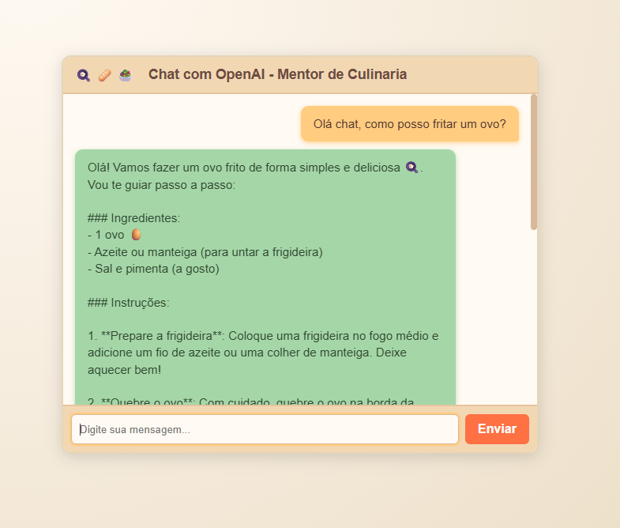

# 🍳 Mentor AI Chat – Assistente de Culinária

<p align="center" style="display:flex;align-items:center;justify-content:center;gap:10px;">
  
  
</p>

---

## 📌 Sobre o Projeto

Este é um **chat web com IA** desenvolvido em **Node.js + Express** no backend e **HTML/CSS/JS** no frontend, integrado à **API da OpenAI**.  
O bot foi configurado como **Mentor de Culinária**, ajudando usuários com receitas, substituições de ingredientes, dicas de preparo e harmonização de sabores.

O estilo visual foi inspirado em uma **cozinha caseira rústica**, com cores quentes e ícones que remetem ao aconchego de cozinhar em casa.

---

## 🎨 Demonstração

<p>
  
</p>

---

## ⚙️ Tecnologias Utilizadas

- **Node.js + Express** → Servidor backend.
- **OpenAI API (GPT-4o-mini)** → Respostas inteligentes de IA.
- **HTML + CSS + JavaScript** → Interface web.
- **dotenv** → Gerenciamento de variáveis de ambiente.
- **CORS** → Comunicação segura entre frontend e backend.

---

## 📂 Estrutura do Projeto

```
culinary-ai-chat/
│── index.html          # Página principal
│── css/styles.css          # Estilos do chat (tema rústico culinária)
│── js/scripts.js          # Lógica do frontend
│── server/server.js           # Servidor Node + Express
│── package.json        # Dependências e scripts
│── .env                # Chaves privadas (não versionar)
│── .env.example        # Exemplo de configuração
```

---

## 🚀 Como Rodar o Projeto

### 1. Clonar o repositório

```bash
git clone https://github.com/SEUUSUARIO/culinary-ai-chat.git
cd culinary-ai-chat
```

### 2. Instalar dependências

```bash
npm install
```

### 3. Configurar variáveis de ambiente

Crie uma conta na OpenAI e coloque sua key no arquivo .env:

```env
OPENAI_API_KEY=sk-xxxx
```

### 4. Rodar o servidor

```bash
npm start
```

---

## 🖥️ Funcionalidades

- Enviar mensagens ao **mentor culinário**.
- IA responde em português, com receitas e dicas de cozinha.
- Sugestões de **substituições de ingredientes**.
- Explicações passo a passo, estilo **livro de receitas**.
- Estilo visual rústico, com ícones 🍞🥗🍳.
- Fundo animado suave que reage ao mouse.

---

## 📱 Responsividade

- Funciona bem em telas desktop e mobile.
- Scroll interno no chat para não estourar o layout.

---

## 📌 Autor

Desenvolvido por **Kauã Aissa** 💻


🔗 [LinkedIn](https://www.linkedin.com/in/kauaaissa)  
🔗 [GitHub](https://github.com/KauaAissa)

---
